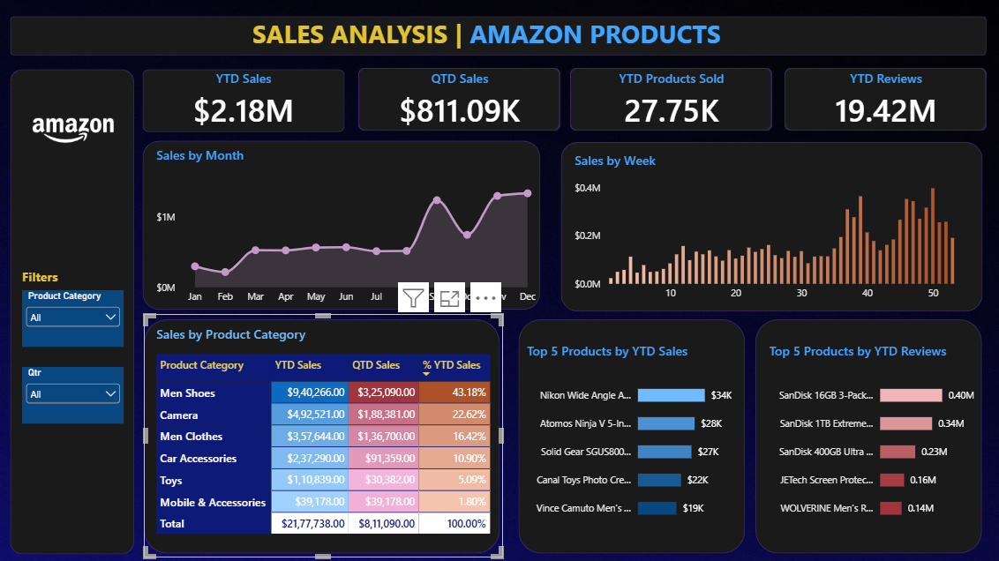

# Amazon Sales Analysis Dashboard \| Power BI

## Project Overview

This project presents an interactive **Amazon Sales Analysis Dashboard**
built using **Microsoft Power BI** to analyze sales performance,
category contribution, product performance, and customer engagement.

The dashboard converts Amazon product data into business insights using
KPI cards, time-series analysis, category-level analysis, and Top 5
product rankings.

## Business Questions

-   What are the YTD Sales, QTD Sales, YTD Products Sold, and YTD
    Reviews?
-   Which categories drive the most revenue?
-   How concentrated is the sales portfolio?
-   Which products are the strongest revenue generators?
-   Do the most-reviewed products also generate the most sales?
-   How does sales performance change over time?
-   Where are the gaps between sales performance and customer
    engagement?

## Dashboard KPIs

  KPI                       Dashboard Value
  ----------------------- -----------------
  **YTD Sales**                 **\$2.18M**
  **QTD Sales**               **\$811.09K**
  **YTD Products Sold**          **27.75K**
  **YTD Reviews**                **19.42M**

## Key Insights

### 1. Men Shoes Is the Largest Revenue Contributor

Men Shoes generated **\$940,266 YTD sales**, **\$325,090 QTD sales**,
and contributes **43.18% of YTD sales**.

**Key takeaway:** Men Shoes alone contributes nearly 43% of total YTD
sales, making it the most important revenue category.

### 2. Three Categories Generate More Than 80% of Sales

  Category             YTD Sales   \% of YTD Sales
  -------------- --------------- -----------------
  Men Shoes        **\$940,266**        **43.18%**
  Camera           **\$492,521**        **22.62%**
  Men Clothes      **\$357,644**        **16.42%**
  **Combined**       **\$1.79M**        **82.22%**

**Key takeaway:** 82.22% of YTD sales come from just three categories,
indicating strong category-level concentration.

### 3. Camera Is the Second-Largest Category

Camera generated **\$492,521 YTD sales**, **\$188,381 QTD sales**, and
**22.62% of YTD sales**.

### 4. Men Clothes Is the Third-Largest Contributor

Men Clothes generated **\$357,644 YTD sales**, **\$136,700 QTD sales**,
and **16.42% of YTD sales**.

### 5. Mobile & Accessories Has the Smallest Sales Contribution

Mobile & Accessories generated **\$39,178 YTD sales**, **\$39,178 QTD
sales**, and **1.80% of YTD sales**.

### 6. Top 5 Products Are Not Dominating Overall Sales

The Top 5 YTD sales products are approximately:

  Rank   Product                                   YTD Sales
  ------ ------------------------------------ --------------
  1      Nikon Wide Angle AF Nikkor 24mm        **\$33.55K**
  2      Atomos Ninja V 5-Inch 4K Monitor       **\$28.44K**
  3      Solid Gear SGUS80006 Hydra GTX         **\$26.87K**
  4      Canal Toys Photo Creator Camera        **\$21.62K**
  5      Vince Camuto Men's Lyre Dress Shoe     **\$19.35K**

Together, these products contribute approximately **\$130K**, or around
**6% of total YTD sales**.

**Key takeaway:** Overall sales are distributed across a broader product
portfolio rather than being heavily dependent on five individual
products.

### 7. Sales Leaders and Review Leaders Are Different

The Top 5 products by recorded YTD reviews are:

  Rank   Product                                       Reviews
  ------ ---------------------------------------- ------------
  1      SanDisk 16GB 3-Pack Ultra microSDHC        **402.8K**
  2      SanDisk 1TB Extreme microSDXC              **337.4K**
  3      SanDisk 400GB Ultra microSDXC              **228.0K**
  4      JETech Screen Protector for iPhone 7/8     **155.7K**
  5      WOLVERINE Men's Rancher WPF                **139.4K**

None of these products appears in the Top 5 YTD Sales list.

**Key takeaway:** Revenue performance and customer engagement are not
interchangeable metrics.

### 8. Sales Show Strong Late-Year Momentum

The monthly sales visual shows a clear acceleration toward the end of
the year, with the strongest performance around **November and
December**.

This raises an important business question:

> What factors are driving the late-year sales acceleration?

Potential areas for further investigation include seasonality,
promotions, pricing, product availability, holidays, and marketing
activity.

## Out-of-the-Box Questions

1.  **Do sales leaders and engagement leaders overlap?**
2.  **Is revenue more concentrated at the category level or product
    level?**
3.  **Can high-review products be considered high-performing products?**
4.  **Where are the largest sales-versus-engagement gaps?**
5.  **What business events could explain the strongest sales weeks?**
6.  **Are the strongest categories consistently strong throughout the
    year?**
7.  **Could high-engagement, lower-sales products represent growth
    opportunities?**
8.  **How much of overall performance depends on seasonal periods?**

## Dashboard Visualizations

-   **Sales by Month --- Line Chart:** identifies trends, seasonality,
    spikes, and declines.
-   **Sales by Week --- Column Chart:** identifies high-performing weeks
    and short-term fluctuations.
-   **Sales by Product Category --- Matrix:** compares YTD Sales, QTD
    Sales, and % YTD Sales.
-   **Top 5 Products by YTD Sales --- Bar Chart:** identifies leading
    revenue contributors.
-   **Top 5 Products by YTD Reviews --- Bar Chart:** identifies leading
    recorded review counts.

## Conclusion

This Amazon Sales Analysis dashboard provides a consolidated view of
**sales performance, category contribution, product performance, and
customer engagement** using Power BI.

The analysis shows **\$2.18M in YTD sales**, with revenue strongly
concentrated across a few major categories. Men Shoes is the dominant
category, contributing **43.18% of YTD sales**, while the top three
categories together account for **82.22%**.

At the individual-product level, however, the Top 5 products contribute
only around **6% of total sales**, suggesting that overall revenue is
more diversified across individual products than the category-level
figures initially suggest.

A key analytical finding is the disconnect between **sales and customer
engagement**. The products with the highest recorded review counts are
not the products generating the highest sales value. This highlights why
businesses should evaluate multiple KPIs rather than relying on review
volume or sales alone.

Overall, the project demonstrates how **Power BI, DAX, Power Query, and
data visualization can transform raw product data into a
decision-support dashboard**.

## Tools & Technologies

-   Microsoft Power BI
-   Power Query
-   DAX
-   Data Visualization
-   Business Intelligence

### Power BI Concepts Demonstrated

KPI development, YTD/QTD analysis, time-intelligence concepts, Top-N
analysis, category analysis, calculated columns, DAX measures,
interactive slicers, data transformation, and data storytelling.

## Resume Description

### Amazon Sales Analysis Dashboard \| Power BI

-   Developed an interactive **Power BI dashboard** analyzing **\$2.18M
    in YTD Amazon sales**, product volume, category performance, and
    customer engagement.
-   Identified **Men Shoes as the largest revenue category at 43.18% of
    YTD sales**, with the top three categories contributing **82.22%**
    of total sales.
-   Performed **Top-N product analysis** and found that the Top 5
    products contributed only \~**6% of total sales**, indicating
    broader product-level revenue distribution.
-   Compared **sales leaders vs. review leaders**, uncovering a clear
    gap between commercial performance and customer engagement.
-   Applied **Power Query, DAX, KPI cards, time-based analysis, matrix
    tables, and interactive visualizations** to transform raw Amazon
    product data into a business-oriented decision-support dashboard.

## Skills Demonstrated

**Power BI \| DAX \| Power Query \| Business Intelligence \| Sales
Analytics \| Data Visualization \| Time-Series Analysis \| KPI
Development \| Top-N Analysis \| Data Storytelling \| Dashboard Design
\| Exploratory Data Analysis**

## Repository Structure

``` text
Amazon-Sales-Analysis-PowerBI/
├── README.md
├── Dashboard/
│   └── Amazon_Sales_Analysis.pbix
├── Data/
│   └── Amazon_Combined_Data.xlsx
└── Images/
    └── dashboard.png
```

To display dashboard screenshot:

``` markdown

```

## Future Enhancements

-   Sales vs. review correlation analysis
-   Month-over-month and week-over-week growth
-   Category growth trends
-   Revenue contribution percentage
-   Price vs. sales analysis
-   Rating vs. sales analysis
-   Discount vs. sales analysis
-   Review-to-sales analysis
-   Product profitability analysis
-   Sales anomaly detection
-   Seasonal trend analysis
-   Identification of high-engagement but low-sales products

## Author

**Ritika Koli**

*Power BI \| Data Analytics \| Business Intelligence*
